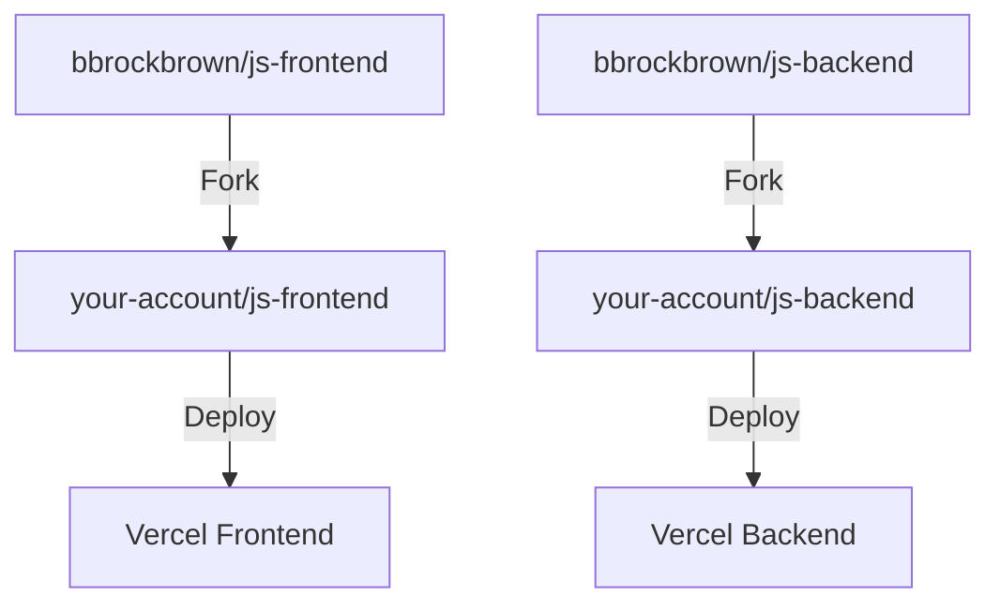

# Getting Started

:::info

**This entire setup should setup should be done only by _one person_ on the team** It should take anywhere between 1-3 hours to complete. If it is taking any longer, PLEASE contact a tech lead for help!

if you are not the member of your team responsible for setting up the starter template, scroll to the bottom
:::

### Keeping track of Account Logins

1. Create a Google Drive for the team if one doesn't exist. Make sure to invite everyone.

2. Create a Google Doc to keep track of the accounts you create.

3. Keep this tab open for the next two steps.

### Creating your Google Account

1. You need to create your own Google account (unless one was provided to you from your client) if they don't already have one.
2. Complete your Google profile setup.
3. Save the login information to the Google Docs.

### Creating Your GitHub Account

1. You need to create your own GitHub account (unless one was provided to you from your client) at https://github.com/signup if they don't already have one
2. Complete your GitHub profile setup and verify your email address.
3. Save the login information to the Google Docs.

### Forking the Template Repositories

Next, you need too:

1. Navigate to the template repositories:
   - Frontend: https://github.com/bbrockbrown/js-frontend
   - Backend: https://github.com/bbrockbrown/js-backend
2. Click the "Fork" button in the top-right corner of each repository
3. Select your personal GitHub account as the destination for the fork



## Prerequisites

Before you begin, make sure you have:

- [Node.js](https://nodejs.org/) version 18.0 or higher
- [Git](https://git-scm.com/) for version control
- A code editor (we recommend [VS Code](https://code.visualstudio.com/))
- [Google](https://google.com/) account
- [Firebase](https://console.firebase.google.com/u/0/?pli=1) account (Will be linked to your google account)

## Installation

0. Setup directories

```bash
cd # whereever you want your code to live in, make sure you can easily access this in the future
mkdir disc-template
```

1. Clone the repositories:

```bash
git clone https://github.com/bbrockbrown/js-frontend.git
git clone https://github.com/bbrockbrown/js-backend.git
```

2. Install dependencies for the frontend:

```bash
cd js-frontend
npm i
```

3. Create the `.env` file for the frontend

```bash
touch .env
```

4. Copy this template for the frontend `.env`

```javascript
# Server Configuration
VITE_BACKEND_URL=http://localhost:5050

# Firebase Configuration (from Firebase Console > Project Settings > Your apps)
VITE_FIREBASE_API_KEY=your_api_key
VITE_FIREBASE_AUTH_DOMAIN=your-project.firebaseapp.com
VITE_FIREBASE_PROJECT_ID=your-project-id
VITE_FIREBASE_STORAGE_BUCKET=your-project.firebasestorage.app
VITE_FIREBASE_MESSAGING_SENDER_ID=your_sender_id
VITE_FIREBASE_APP_ID=your_app_id
VITE_FIREBASE_MEASUREMENT_ID=G-XXXXXXXXXX

```
Instructions for finding these keys will be in the following **Firebase** section.

5. Change directories into the backend

```bash
cd ..
cd js-backend
```

6. Install dependencies for the backend

```bash
npm i
```

7. Create `.env` file for the backend

```bash
touch .env
```

8. Copt this template for the backend `.env`

```javascript
# Firebase Configuration
FIREBASE_SERVICE_ACCOUNT_KEY='{"type":"service_account","project_id":"your-project-id",...}' # Your Firebase service account JSON

# Server Configuration
PORT=5050
FRONTEND_URL=http://localhost:5173
API_URL=http://localhost:5050
FRONTEND_URL_DEV=http://localhost:5173
NODE_ENV=development

DB_TYPE=postgres
# Supabase Postgres Configuration
POSTGRES_URL=your_sb_postgres_url

```

## Firebase Setup

### 1. Create a Project

1. Go to [Firebase Dashboard](https://console.firebase.google.com/u/0/?pli=1)
2. Make sure you are not on the Northwestern email, it will get stuck at "select parent resources". **You must be on the designated email account for the project**.
2. Create a new project (No AI Features)
3. Fill in project details

<!-- ### 3. Configure Authentication

1. Go to Authentication settings in Supabase dashboard
2. Enable Email auth provider
3. Configure Email templates (optional) _do not worry about this for now please_
4. Set Site URL to your frontend URL \_this is going to be localhost to start off, you will change it to your deployed url on vercel later -->

### 2. Configure Authentication

1. Go to Build -> Authentication settings on the left sidebar:

2. Click "Get Started"

3. Under "Native Providers", select "email/password"

4. Enable the first option "Email/Password" but NOT "Email Link". Click **Save**.

### 3. Google OAuth Setup

Thankfully, Firebase comes with OAuth integrated.

1. Inside the Authentication tab, under "Sign-in method", click on **Add new provider**.

2. Select **Google**. Click enable.

3. Fill in "public-facing name" with something. I recommend client-name-disc

4. Choose your own email for support email.

### 4. Configure Frontend ENV variables

Now, we need to fill in the frontend env with the proper variables.
1. Look under Project Overview
2. Create a new "app" if you haven't already
3. Click "web" and fill in the project name. You do not need to set up Firebase Hosting yet. 
4. Once you click **continue**, you will be shown the following keys to fill in your .env.
5. To find the measurement ID, you must go to Project Settings -> Integrations and enable Google Analytics.

### 5. Configure Backend ENV variables

The backend also needs a special key called the **service account key**.

1. Navigate to Project Settings -> Service Accounts
2. Under Firebase Admin SDK, generate a new private key.
3. Confirm and download the JSON file. **This is your private key, do not upload it anywhere public**.
4. Copy and paste the content of the JSON file into FIREBASE_SERVICE_ACCOUNT_KEY. Note that the whole value needs to be wrapped in a quote.

## Supabase Setup

To start off, we will use Supabase + PostgresSQL for the database. We have set up the codebase to migrating over to AWS is easy, more on that later.

1. Go to [Supabase](https://supabase.com)
2. Sign Up with the dedicated email for the team through Google OAuth.
3. Create a new organization (name it whatever you want, preferably your client's company)
4. Go into that org you just created
5. Click "New Project"
6. Fill in the details. REMEMBER YOUR DATABASE PASSWORD. Keep Data API enabled.
7. Once you create the project, click on "connect" near the top of the screen.
8. Under "Connection String", change method to "Transaction Pooler" and copy text provided to you. This is your POSTGRES_URL.
9. Now, go back to your backend .env and paste that string into POSTGRES_URL. Replace [YOUR-PASSWORD] with the password you created earlier (no square brackets).

Now, we need to create the users table.

1. In Supabase, navigate to SQL Editor.
2. Paste in the following code and run:

```javascript
`CREATE TABLE IF NOT EXISTS users (
  id            SERIAL PRIMARY KEY,
  firebase_uid  VARCHAR(128) NOT NULL,
  username      VARCHAR(50)  NOT NULL,
  email         VARCHAR(255) NOT NULL,
  firstname     VARCHAR(100) DEFAULT NULL,
  lastname      VARCHAR(100) DEFAULT NULL,
  created_at    TIMESTAMPTZ  NOT NULL DEFAULT CURRENT_TIMESTAMP,
  updated_at    TIMESTAMPTZ  NOT NULL DEFAULT CURRENT_TIMESTAMP,

  CONSTRAINT idx_firebase_uid UNIQUE (firebase_uid),
  CONSTRAINT idx_username     UNIQUE (username),
  CONSTRAINT idx_email        UNIQUE (email)
);

CREATE OR REPLACE FUNCTION update_updated_at_column()
RETURNS TRIGGER AS $$
BEGIN
    NEW.updated_at = CURRENT_TIMESTAMP;
    RETURN NEW;
END;
$$ language 'plpgsql';

CREATE TRIGGER update_users_updated_at
    BEFORE UPDATE ON users
    FOR EACH ROW
    EXECUTE PROCEDURE update_updated_at_column();
```

## Verify Setup

For both the frontend and backend directories just do the following:

_you will probably need to open two terminals for this!_

```bash
npm run dev
```

Backend server will start at `http://localhost:5050`

Frontend server will start at `http://localhost:5173`

1. Your authentication should now be configured for both email and Google login
2. Test both methods in development:
   - Run your frontend locally (`npm run dev`)
   - Try creating an account with email
   - Try signing in with Google
   - If either fails, double-check all URLs and credentials

After you have gone through all of these steps, you should be able to create users, see them populate on Supabase, and have them displayed on your web app after logging in.

You should also get emails from Supabase whenever you first sign-up and requests a password. All of the respective pages on the frontend should work with this as well.

:::note

Once you have verified that **everything** works, share the `.env` credentials with the rest of your team!!!

:::

## Development Tools

### Recommended VS Code Extensions

- [ESLint](https://marketplace.visualstudio.com/items?itemName=dbaeumer.vscode-eslint)
- [Prettier](https://marketplace.visualstudio.com/items?itemName=esbenp.prettier-vscode)

### Available Scripts

- `npm run dev` - Start development server
- `npm run test` - Run tests (if you have any)
- `npm run lint` - Format all files with Prettier

## Instructions for Everyone Else

If you are **not** the member of your team who did all of the steps from above:

1. Clone the _forked_ repos from the github account that setup all of the accounts and projects for you
2. Get the respective `env` variables.
3. Verify that everything is running locally
